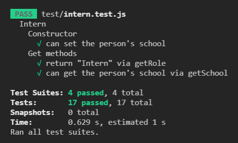
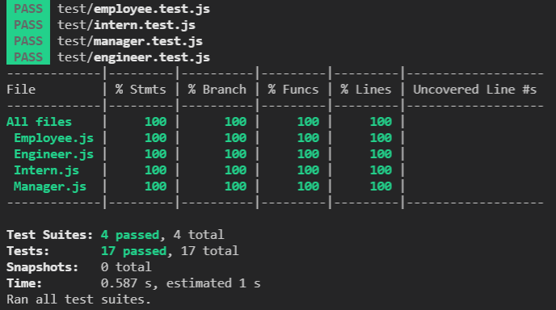
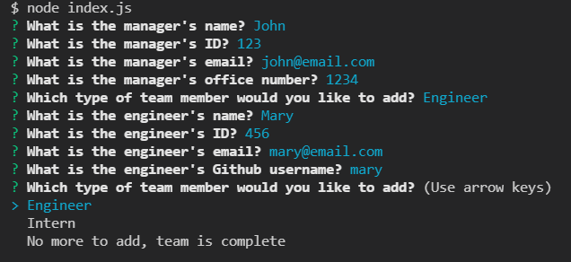
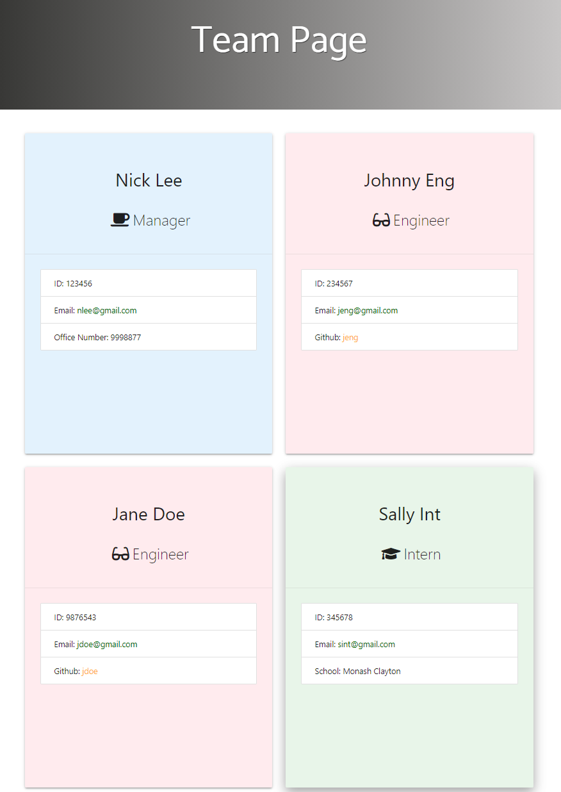

# Team Profile Page Generator
A tool to generate a website for your team with their contact details.

Link to instructional video: https://youtu.be/8sMK2sCnC_A

Link to code repository: https://github.com/raven-bootcamp/team-profile-generator

## Table of Contents
- [The Task](#the-task)
- [Instructions for Use](#instructions-for-use)
- [User Story](#user-story)
- [Acceptance Criteria](#acceptance-criteria)
- [Tests](#tests)
- [Screenshot of UI](#screenshot-of-ui)
- [Screenshot of Generated File](#screenshot-of-generated-file)

## The Task
Our task is to build a Node.js command-line application that gathers information about employees on a software engineering team, then generates an HTML webpage that displays summaries for each person. Testing is key to making code maintainable, so we’ll also write a unit test for every part of your code and ensure that it passes each test.

## Instructions for Use
These instructions assume you have Git working, and you have cloned the repository to your local computer.

1. From the base directory of the cloned repository, type `npm install`, which will install the necessary library files
1. Once the installation is complete, run the application by typing `node index.js`
1. Answer all the questions asked by the application
1. Once complete, change to the `output` directory to find the newly generated `team.html` file
1. Open the file in your browser to view it

N.B. for information about how to run the tests, please see the "Tests" section of this document.

## User Story
```
AS A manager
I WANT to generate a webpage that displays my team's basic info
SO THAT I have quick access to their emails and GitHub profiles
```

## Acceptance Criteria
```
GIVEN a command-line application that accepts user input
WHEN I am prompted for my team members and their information
THEN an HTML file is generated that displays a nicely formatted team roster based on user input
WHEN I click on an email address in the HTML
THEN my default email program opens and populates the TO field of the email with the address
WHEN I click on the GitHub username
THEN that GitHub profile opens in a new tab
WHEN I start the application
THEN I am prompted to enter the team manager’s name, employee ID, email address, and office number
WHEN I enter the team manager’s name, employee ID, email address, and office number
THEN I am presented with a menu with the option to add an engineer or an intern or to finish building my team
WHEN I select the engineer option
THEN I am prompted to enter the engineer’s name, ID, email, and GitHub username, and I am taken back to the menu
WHEN I select the intern option
THEN I am prompted to enter the intern’s name, ID, email, and school, and I am taken back to the menu
WHEN I decide to finish building my team
THEN I exit the application, and the HTML is generated
```

## Tests
To run the tests, while in the main project directory, simply type this command:

`mpm run test`

This is a shortcut to the test command held in the `package.json` file, which is `jest --verbose`.



If you have Jest installed globally, you can run that command on its own.

To run the tests and see the coverage, use the following command:

`jest --coverage`



## Screenshot of UI


## Screenshot of Generated File
